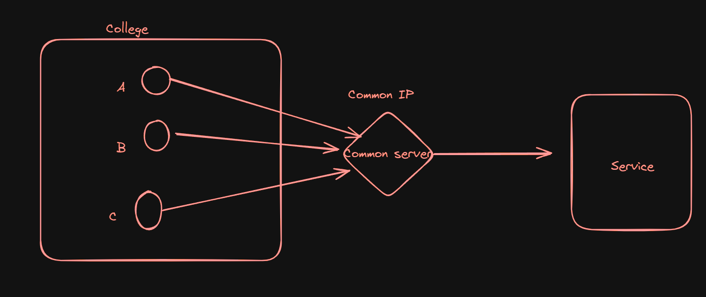

# Rate Limiting and DDOS

### **What is Rate Limiting?**

Rate limiting is a technique used to control the number of requests a server receives from a specific user (user_id) or IP address. There are various ways to implement rate limiting:

1. **Application-Level Rate Limiting**: Implemented directly within the application, such as in an Express server.
2. **Load Balancer Rate Limiting**: Implemented at the load balancer level, not within the application itself.



- In the above diagram, the service is rate limiting based on IP addresses. The downside of this approach is that if IP address A is blocked, all users connected to the same IP will also be blocked. To mitigate this, services can block users based on their specific user IDs.

### **Why Rate Limiting?**

- **Preventing Overloads**: Protects the server from being overwhelmed by too many requests.
- **Mitigating Attacks**: Helps defend against attacks such as brute force attacks.
- **Managing Traffic**: Ensures fair distribution of resources, such as during ticket sales for popular events.

### **Common Places to Add Rate Limits**

Rate limiting should be implemented in various parts of an application, such as:

- Password reset processes using OTP (One-Time Password) sent via email. Without rate limiting, an attacker could brute force the OTP by generating multiple requests.

### **Mimicking an Attack to Generate OTP and Reset Password**

Below is an example of a Node.js application with two endpoints: **`generate-otp`** and **`reset-password`**.

```jsx
import express from "express";

const app = express();
const PORT = process.env.PORT || 3000;

app.use(express.json());

const otpService: Record<string, string> = {};

app.post("/generate-otp", otpLimiter, (req, res) => {
  const email = req.body.email;
  if (!email) {
    return res.status(404).json({
      error: "Please send the email",
    });
  }

  const otp = Math.floor(100000 + Math.random() * 900000).toString();
  otpService[email] = otp;

  console.log(`OTP for ${email} is ${otp}`);
  res.status(201).json({
    message: "OTP gen and logged",
  });
});

app.post("/reset-password", passwordLimiter, (req, res) => {
  const { email, password, otp } = req.body;
  if (!email || !password || !otp) {
    return res.status(404).json({
      error: "Email, password, otp required",
    });
  }

  if (otpService[email] == otp) {
    console.log(`Password of ${email} is reset to ${password}`);
    return res.status(200).json({
      message: "Password reset succesfully",
    });
  } else {
    return res.status(404).json({
      error: "Invalid OTP",
    });
  }
});

app.listen(PORT, () => {
  console.log(`Listening on PORT ${PORT}`);
});
```

- The **`generate-otp`** endpoint generates an OTP and logs it. In a real-world scenario, the OTP would be sent to the user's email. However, without rate limiting, an attacker could brute force the **`reset-password`** endpoint. Below is a script demonstrating a brute-force attack:

  ```jsx
  import axios from "axios";

  async function attackLogic(otp: string) {
    try {
      const a = await axios.post("http://localhost:3000/reset-password", {
        email: "hola@gmail.com",
        otp: otp,
        password: "abcd@abcd",
      });
    } catch (err: any) {
      console.log(err.message);
    }
  }

  async function main() {
    for (let i = 100000; i < 1000000; i += 100) {
      const promises = [];
      console.log(i);
      for (let j = 0; j < 100; j++) {
        promises.push(attackLogic((i + j).toString()));
      }
      // batching 100 request at a time
      await Promise.all(promises);
    }
  }

  main();
  ```

## To mitigate this, we can add rate limiting to our server code:

```jsx
import express from "express";

const app = express();
const PORT = process.env.PORT || 3000;

app.use(express.json());

import { rateLimit } from "express-rate-limit";

// rate limiting logic
const otpLimiter = rateLimit({
  windowMs: 5 * 60 * 1000,
  limit: 4,
  standardHeaders: "draft-7",
  legacyHeaders: false,
});

const passwordLimiter = rateLimit({
  windowMs: 15 * 60 * 1000,
  limit: 5,
  standardHeaders: "draft-7",
  legacyHeaders: false,
});

const otpService: Record<string, string> = {};

app.post("/generate-otp", otpLimiter, (req, res) => {
  const email = req.body.email;
  if (!email) {
    return res.status(404).json({
      error: "Please send the email",
    });
  }

  const otp = Math.floor(100000 + Math.random() * 900000).toString();
  otpService[email] = otp;

  console.log(`OTP for ${email} is ${otp}`);
  res.status(201).json({
    message: "OTP gen and logged",
  });
});

app.post("/reset-password", passwordLimiter, (req, res) => {
  const { email, password, otp } = req.body;
  if (!email || !password || !otp) {
    return res.status(404).json({
      error: "Email, password, otp required",
    });
  }

  if (otpService[email] == otp) {
    console.log(`Password of ${email} is reset to ${password}`);
    return res.status(200).json({
      message: "Password reset succesfully",
    });
  } else {
    return res.status(404).json({
      error: "Invalid OTP",
    });
  }
});

app.listen(PORT, () => {
  console.log(`Listening on PORT ${PORT}`);
});
```

### **DDOS (Distributed Denial of Service)**

A DDOS attack involves multiple machines attacking a service simultaneously, overwhelming the server and preventing it from handling legitimate requests.


## **Preventing DDOS Attacks**

- **Cloudflare**: A service like Cloudflare offers DDOS protection by acting as a proxy. All requests to the service go through Cloudflare, which can filter out malicious traffic.


### **Captchas**

Captchas are security measures to distinguish between human users and bots. They help prevent:

- **Web Scraping**: Bots scraping data from websites.
- **Fraudulent Activities**: Bots performing illegal activities.

One service for implementing captchas is **Cloudflare Turnstile**.

### **Integrating Captcha Service in an Application**

To integrate Cloudflare Turnstile with a React project, follow these steps:

1. Generate a captcha for your website on Cloudflare.
2. Obtain the public (site-key) and private (secret-key) keys.
3. Use the public key on the client-side and the private key for server verification.

Below is the client-side code using React:

```jsx
import { useState } from "react";
import { Turnstile } from "@marsidev/react-turnstile";
import axios from "axios";
import "./index.css";

function App() {
  const [password, setPassword] = useState < string > "";
  const [token, setToken] = useState < string > "";
  const [OTP, setOTP] = useState < string > "";
  // const [responseData, setResponseData] = useState<string>("");

  async function sendInfoToBackend() {
    try {
      console.log("Sending data to backend...");
      console.log("Password:", password);
      console.log("OTP:", OTP);
      console.log("Token:", token);

      const data = await axios.post("http://localhost:3000/reset-password", {
        email: "hola@gmail.com",
        otp: OTP,
        password: password,
        token: token,
      });

      // setResponseData(data.data);
      console.log(data.data);
    } catch (err) {
      console.error("Error occurred:", err);
    }
  }

  return (
    <div className="min-h-screen bg-gray-900 flex items-center justify-center py-12 px-4 sm:px-6 lg:px-8">
      <div className="max-w-md w-full space-y-8">
        <div>
          <h2 className="mt-6 text-center text-3xl font-extrabold text-white">
            Change Your Password
          </h2>
        </div>
        <div className="bg-gray-800 p-8 rounded-lg shadow-lg">
          <input
            type="password"
            placeholder="New Password"
            className="w-full p-3 mb-4 text-gray-900 rounded-lg border border-gray-300 focus:outline-none focus:ring-2 focus:ring-blue-500 focus:border-transparent"
            onChange={(e) => setPassword(e.target.value)}
          />
          <input
            type="text"
            placeholder="OTP"
            className="w-full p-3 mb-6 text-gray-900 rounded-lg border border-gray-300 focus:outline-none focus:ring-2 focus:ring-blue-500 focus:border-transparent"
            onChange={(e) => setOTP(e.target.value)}
          />
          <button
            onClick={() => sendInfoToBackend()}
            className="w-full bg-blue-600 text-white p-3 rounded-lg font-semibold hover:bg-blue-700 focus:outline-none focus:ring-2 focus:ring-offset-2 focus:ring-blue-500 mb-4"
          >
            Change Password
          </button>
          <Turnstile onSuccess={(token) => setToken(token)} siteKey={sitekey} />
        </div>
        {/* <div>
          {responseData && (
            <div className="bg-gray-700 p-4 rounded-lg text-white mt-4">
              <p>Server Response: {responseData}</p>
            </div>
          )}
        </div> */}
      </div>
    </div>
  );
}

export default App;
```

- This code from above which is checking for captcha. If verification is successful, it will generate a unique token which client has to send to the server for confirmation.
  ```jsx
  <Turnstile onSuccess={(token) => setToken(token)} siteKey={sitekey} />
  ```
- Integrating this in our reset-password endpoint.

  ```jsx
  import express from "express";
  import cors from "cors";

  const app = express();
  const PORT = process.env.PORT || 3000;

  app.use(cors());
  app.use(express.json());

  import { rateLimit } from "express-rate-limit";

  const otpLimiter = rateLimit({
    windowMs: 5 * 60 * 1000,
    limit: 4,
    standardHeaders: "draft-7",
    legacyHeaders: false,
  });

  const passwordLimiter = rateLimit({
    windowMs: 15 * 60 * 1000,
    limit: 5,
    standardHeaders: "draft-7",
    legacyHeaders: false,
  });

  const otpService: Record<string, string> = {};

  app.post("/generate-otp", otpLimiter, (req, res) => {
    const email = req.body.email;
    if (!email) {
      return res.status(404).json({
        error: "Please send the email",
      });
    }

    const otp = Math.floor(100000 + Math.random() * 900000).toString();
    otpService[email] = otp;

    console.log(`OTP for ${email} is ${otp}`);
    res.status(201).json({
      message: "OTP gen and logged",
    });
  });

  app.post("/reset-password", passwordLimiter, async (req, res) => {
    const { email, password, otp, token } = req.body;
    if (!email || !password || !otp || !token) {
      return res.status(404).json({
        error: "Email, password, otp required",
      });
    }

    /* Code for verifying the Captcha */
    let formData = new FormData();
    formData.append("secret", SECRET_KEY);
    formData.append("response", token);

    const url = "https://challenges.cloudflare.com/turnstile/v0/siteverify";
    const result = await fetch(url, {
      body: formData,
      method: "POST",
    });

    const outcome = await result.json();
    if (!outcome.success) {
      return res.json("Invalid Captcha");
    }

    /* Code for verifying the Captcha*/

    if (otpService[email] == otp) {
      console.log(`Password of ${email} is reset to ${password}`);
      return res.status(200).json({
        message: "Password reset succesfully",
      });
    } else {
      return res.status(404).json({
        error: "Invalid OTP",
      });
    }
  });

  app.listen(PORT, () => {
    console.log(`Listening on PORT ${PORT}`);
  });
  ```

- This is the code for verification of captcha from above.

  ```jsx
    let formData = new FormData();
    formData.append("secret", SECRET CODE);
    formData.append("response", token);

    const url = "https://challenges.cloudflare.com/turnstile/v0/siteverify";
    const result = await fetch(url, {
      body: formData,
      method: "POST",
    });

    const outcome = await result.json();
    if (!outcome.success) {
      return res.json("Invalid Captcha");
    }
  ```

- For more info you can cloudflare doc for setting up the captcha in your service. Here is the link [`Cloudflare Turnstile · Cloudflare Turnstile docs`](https://developers.cloudflare.com/turnstile/)
