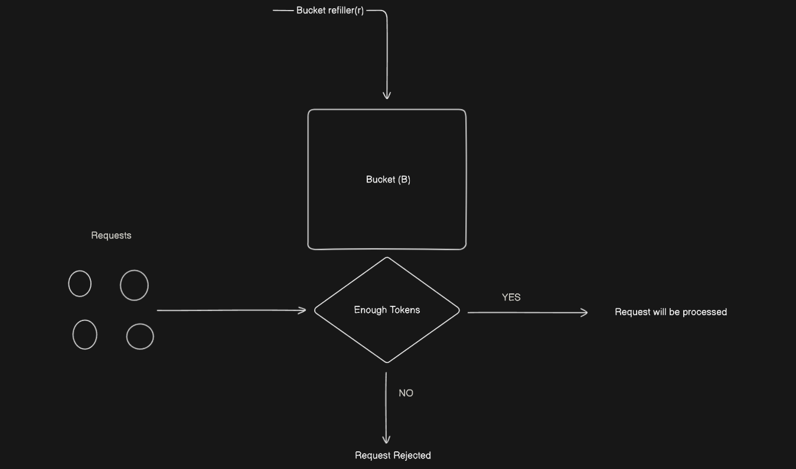

# Rate Limiting Techniques

## Token Bucket Algorithm

- The Token Bucket algorithm is a popular method for rate limiting in network traffic management and API request handling. Here’s a detailed explanation:

## Concept:

- Bucket Capacity (B): This represents the maximum number of tokens the bucket can hold. It defines the burst capacity, allowing the system to handle a burst of requests.
- Tokens: Tokens act as permits for processing requests. Each request consumes one token. If no tokens are available, the request is rejected.
- Refill Rate (r): This is the rate at which tokens are added to the bucket over time. It ensures a constant replenishment of tokens but cannot exceed the bucket's capacity.

## How It Works:

1. Initialization:
   - The bucket is initially filled with B tokens.
2. Request Processing:
   - When a request arrives, it checks for available tokens in the bucket.
   - If tokens are available, one token is consumed per request, and the request is processed.
   - If no tokens are available, the request is rejected.
3. Token Refill:
   - Tokens are added to the bucket at a constant rate, r, over time.
   - The number of tokens in the bucket cannot exceed the bucket’s capacity, B.
4. Example:

- Let's go through an example with specific values to illustrate how the algorithm works:

  - Initial Bucket Capacity (B): 10 tokens
  - Refill Rate (r): 1 token per second

- At Time t = 0:

  - The bucket starts full with 10 tokens.
  - 5 requests arrive.
  - Tokens consumed: 5
  - Tokens remaining: 10 - 5 = 5
  - All 5 requests are processed successfully.

- At Time t = 1:

  - No requests arrive.
  - Tokens added: 1 (according to the refill rate)
  - Tokens in the bucket: 5 + 1 = 6

- At Times t = 2, 3, and 4:

  - No requests arrive.
  - Tokens added per second: 1
  - Tokens in the bucket after each second:
  - t = 2: 6 + 1 = 7
  - t = 3: 7 + 1 = 8
  - t = 4: 8 + 1 = 9

- At Time t = 5:

  - No requests arrive.
  - Tokens added: 1 per second for the past 4 seconds.
  - Tokens in the bucket: 9 + 1 = 10 (maximum capacity)

- This example demonstrates how the Token Bucket algorithm handles bursts of requests while ensuring a steady rate of processing over time. By regulating the number of tokens available, it effectively controls the rate at which requests are processed, preventing system overloads and ensuring fair usage.

- Token Bucket Implementation -> [TokenBucket](/rate_limiting_strategies/token_bucket/src/token_bucket.ts)
